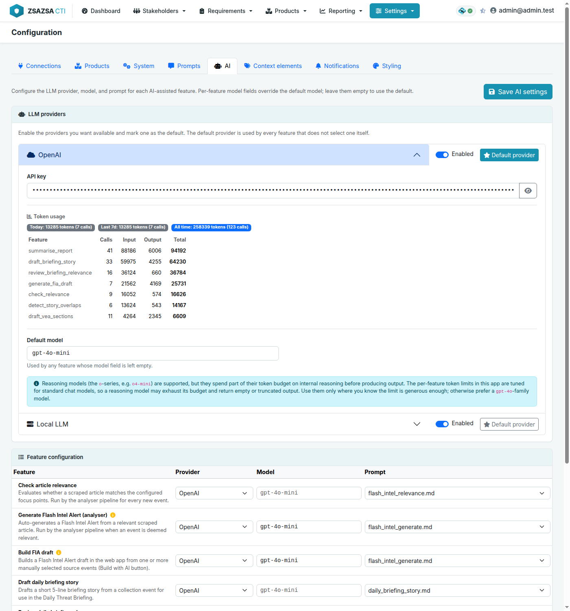

# zsazsa CTI

zsazsa is a **CTI program** management and production platform built around [MISP](https://www.misp-project.org/). It links collection, triage, analyst workflows, requirement management, publishing and stakeholder delivery in one place.

It is designed for teams that want to run threat intelligence as an operational capability, not as loose documents and disconnected scripts. In one workflow, analysts can move from source events to intelligence products, align output to PIR and GIR requirements, distribute the products to stakeholders, and collect feedback.

If you are setting zsazsa up, start with [INSTALL.md](INSTALL.md). It covers what you need for installation, configuration and deployment. If you are upgrading, read [CHANGELOG.md](CHANGELOG.md) first: releases can carry a migration you need to run.

Note that zsazsa is developed with the support of AI.

## Overview


## Intelligence flow

zsazsa follows the daily CTI workflow, from collection through triage and analysis to publishing and feedback. The main areas are:

- **Dashboard** gives a live snapshot of the program: active PIRs and GIRs, stakeholder counts, analyser status, and scraper events still waiting for triage.
- **Stakeholders** record who receives your output, with role, organisation, TLP clearance, product subscriptions and notification channels, plus a power and interest matrix to plan engagement.
- **Requirements (PIR and GIR)** hold the intelligence questions that drive collection, with their scope, ownership and distribution.
- **RFIs** handle one-off requests from intake to closure, with an SLA, an owner, a linked PIR or GIR, response confidence, attachments, notes and feedback.
- **Data collection** is the cached view of the scraper MISP, other MISP servers, and manual or newsletter sources. You browse and triage events, enrich them with scope items from the MISP galaxies, generate an AI summary, and start a product straight from a source event.
- **Products** are a repository of what you publish, with preview and feedback. zsazsa produces Flash Intel Alerts, Vulnerability advisories, Daily threat briefings, Threat landscape reports, Indicator feeds and Threat actor profiles.
- **Statistics** cover pipeline and program metrics, RFI and feedback data, and a scope coverage showing where collection and analysis are concentrated. A CTI-CMM maturity panel maps against levels CTI0 to CTI3.
- **Background jobs** analyser runs, AI summaries and the scheduled collection runs.


The rest of this section walks through each area with screenshots.

### Records in MISP

zsazsa keeps its data in MISP, using events, object templates, attributes and event reports. This keeps auditability clear and lets teams review the raw records directly in MISP. The MISP **event history** is an audit trail of every change to a product, stakeholder or requirement.


### Dashboard

The dashboard gives a quick **operational overview**, including pipeline state, active requirements, stakeholder info and recent processing results.


The built-in CTI reference panel helps teams apply common intelligence concepts, including the Admiralty Scale, TLP and CTI evaluation criteria.


### Stakeholders

Stakeholders are managed locally and linked to MISP organisations. Each record supports internal or external roles, multiple contact fields, TLP clearance, product subscriptions and delivery preferences.


Stakeholders can be **linked to PIRs and GIRs** for ownership and distribution, which makes accountability and delivery easier to track. You are not tied to zsazsa for presenting this information either. The stakeholder list can be exported as Markdown, so it is easy to share or reuse outside the tool.

**Stakeholder matrix**

For each stakeholder you record how much they **influence** the direction of your CTI program (their power) and how much they care about its output (their **interest**). From those two values zsazsa works out the quadrant the stakeholder falls into and places them on a power and interest matrix, so you can see who to engage closely and who to simply keep informed. 


### Requirements

#### PIR

A PIR captures the intelligence question and its context, the intelligence level and its priority, along with the decision it supports and any sub-questions that break it down.

To make collection easier, zsazsa can **highlight events from your data collection sources that match a PIR**. For that to work you add scope elements to the requirement: geographic scope, sector, threat actor, attack technique, vendor and product, or even a specific incident or campaign. Whenever an incoming event matches that scope it is flagged in the data collection view.


**Triage** allows submitted PIRs to be acknowledged, approved, deferred, rejected or merged.


The PIR detail view combines scope, sub-questions, ownership, distribution and collection mapping.


#### GIR

A GIR records intelligence needs over longer cycles, including review cadence, scope and the expected outputs for recurring reporting.


As with a PIR, you can add scope items and threat context to a GIR so that matching events are highlighted automatically in the data collection view.

#### RFI

The RFI workflow covers intake through closure, with priority, SLA, owner assignment, requirement linkage and response tracking.


The RFI detail view lets you add notes and file attachments, and, as with the other requirements, capture feedback from the people who raised the request.


### Data collection

The data collection view provides a cached feed with filters for source, tags and context. It is the **central location for the daily work**, where you navigate between everything from the sources you have set up: the MISP scraper, MISP instances you are connected to, and the manual and newsletter sources you add manually.


**CTI evaluation** can be applied during collection triage to score relevance and confidence before product drafting.


Events an analyst has looked at and does not want to see again can be **set aside**. For events on your own MISP, meaning the scraper and manual entries, this is the existing reject action, `workflow:state="rejected"`. Events pulled from another MISP are dismissed instead with a local tag, `zsazsa:event="dismiss"`. This is configurable under Configuration > Context elements. Dismissed events stay in the cache but are hidden. To bring one back, remove the tag in MISP.

An analyst can **enrich an event** with scope: geographic reach, targeted sector, threat actor and the techniques used, from the [MISP galaxies](https://misp-galaxy.org/).


If nothing relevant came in through the configured sources, an analyst can also add an article by hand,


or parse one straight from a security newsletter, such as the one from CTI Robot of ETDA.


The newsletter import can also read editions that arrive in **a mailbox over IMAP**.


### Intelligence products
From the same view, analysts can **launch intelligence product creation** from selected source events.


#### Daily threat briefing

**Daily threat briefing** drafting is integrated into the collection workflow.


#### Vulnerability advisory

**Vulnerability advisory** creation is similar, with evidence and indicators from source events.


#### Flash intel alert

In the same way, you can raise a **Flash intel alert** from a threat event.


#### Threat actor profile

zsazsa also lets you build a **threat actor profile**. You usually start from what the MISP galaxies already hold about the actor, use that as a first draft, and expand it with your own knowledge and investigation.


When you combine your own findings with the galaxy data, each profile builds a **Diamond Model** view of the actor across adversary, infrastructure, capability and victim.


When tracking an actor you often want to list the infrastructure you have observed. You do that with a separate product, the indicator feed, and a threat actor profile can be linked to one or more of them.


### Indicator feed

The indicator feed is another product. You build a detailed query against MISP and get back the matching list of indicators.


A useful detail is that the feed is kept as a PyMISP query. zsazsa shows you that query and lets you copy it, so you can reuse it elsewhere.


More often you will not need to copy anything, because zsazsa gives **each feed its own unique URL**. Point a tool at that URL and it pulls the indicators directly, without a login.


A typical use case: your SOC needs a set of indicators to investigate. Instead of copying them by hand or asking the SOC to get the data out of MISP, you build an indicator feed, perhaps tied to a threat actor profile, send it as a product through the notification channels, and the recipients receive it as a plain value list or as CSV.

### Statistics

The statistics pages combine operational metrics with CTI maturity info.


The scope statistics show how often each scope value is used across PIRs, GIRs, threat actor profiles and daily briefings. Clicking a value opens the entries behind the number, each one linking to its detail page, so you can see straight away which requirements and products claim a given country, sector or technique.

### AI support

AI-assisted features support analyst efficiency in triage, relevance checking and drafting.

zsazsa works with two kinds of LLM provider: **OpenAI**, and a **local LLM** reached over an OpenAI-compatible API such as the one [Ollama](https://ollama.com/) exposes. Both are set up on the AI tab of the configuration page. Each provider can be enabled or disabled on its own, and one of the two is marked as the default provider. Running a local model keeps event content on your own infrastructure, which matters because these features send raw MISP event text to whichever provider is configured.

The OpenAI card holds the API key, the token usage counters and the default model. The local LLM card holds the network location of the server, an API key for servers that ask for one, and its own default model. The network location is the base URL of the endpoint, for example `http://127.0.0.1:11434`, and the `/v1` path is added for you if you leave it off. Token usage is recorded per provider, so local calls are counted separately from OpenAI ones.



Each feature chooses its own **provider, model, temperature and prompt** in the feature table under the provider cards. An empty model field means the feature uses the default model of the provider it points at, and an empty temperature leaves sampling to the model. A provider that is switched off is no longer offered in the table, and it cannot be switched off while features are still pointing at it.

Alongside relevance checking, briefing stories, report summaries and advisory drafts, three options work on the products themselves. A **threat actor profile** can be drafted from the selected actors and the MISP galaxy context. A **threat landscape report** can be drafted from the collection events queued for it. A **flash intel alert or vulnerability advisory** can be audited against its source events before publishing.

Two things to watch with a local model. Reasoning models spend part of the token budget thinking before they answer, and the per-feature budgets are sized for a straight answer; zsazsa asks the server to skip the thinking step, which Ollama honours, but a server that ignores the request can spend the whole budget and return nothing.

### Background jobs

The work that takes longer runs in the background: an analyser action started from the dashboard, a batch of AI summaries from data collection, a single summary on one event, and the scheduled analyser and mailbox runs. 

A **badge in the top bar** displays the running jobs. A job that stops reporting for half an hour is shown as stalled rather than spinning forever. Scheduled runs are also in the job list. So a cron analyser run is visible while it is running and not only once it appears in the history. The job state is kept in **Redis**.  The **Pipeline page** holds the history logs of the jobs. Entries whose source event has since been rotated out of the scraper MISP are hidden until you switch on *Include orphaned*, and *Purge orphaned* drops those rows for good.

### Collection source management

Source management lets you manage **data collection sources** centrally, including manual sources and additional MISP instances.


## Notification and distribution flow

The product distribution is built around stakeholders, roles, product subscriptions, audiences and notification channels. The intended flow is as follows.

**Stakeholders**

- A stakeholder is created and takes on exactly one role (SOC, Incident Response, Cyber Threat Intelligence, and so on). 
- Each stakeholder indicates which notification channels they want to receive products on. 
- A stakeholder also subscribes to one or more product types.

**Products**

- A product is created with one or more audiences. An audience is a stakeholder role, so selecting an audience selects the set of stakeholders holding that role. 
- When a product is published, every selected audience is resolved to its matching stakeholders, and a stakeholder receives the product only if all of the following are true
    - the stakeholder's role is in the product's audience
    - the stakeholder is subscribed to that product type, 
    - and the stakeholder's TLP clearance is high enough for the product's TLP. 
- Eligible stakeholders then receive the product over the notification channels they configured. 

**Channels**
A channel can accept every product, or it can be restricted to specific product types. [Flowintel](https://flowintel.org/) is an example of a restricted channel: a case is created only on the Flowintel instances those recipients subscribed to, and only for products that are enabled for that instance in its `case_templates` configuration.

## What the analyser does

The dashboard has a **Start analyser** button with three options: **Daily threat briefing**, **Flash intel alert** and **Vulnerability advisory**. All three start from the same events, but each one decides differently what to do with them. None of them publish anything or notify stakeholders. They only create **drafts** that you then review, edit and publish yourself.

### Executed for all three options

1. Refreshes the data collection cache.
2. Asks the scraper MISP for events created **today** (UTC) that have the scraper tag (`SCRAPER_MARKER_TAG`), up to `MISP_SCRAPER_LIMIT` events.
3. Keeps only events that still need work, with workflow state `incomplete` or `ongoing`. Events marked `complete` or `rejected` are left alone.
4. Drops events it cannot use: the article could not be fetched (HTTP error) or the report is empty. These are `rejected`.
5. For each remaining event it makes sure there is an AI summary report, and creates one if it is missing.

### Daily threat briefing

This option is about **situational awareness**, not requirements.

1. It applies the title exclusion list (`DAILY_BRIEFING_TITLE_EXCLUSIONS`) and skips events already used in an earlier briefing.
2. For each event it asks the AI whether the story is relevant to your organisation, judged against the focus points (geographies, sectors, technologies, threat types and threat actors) set in Settings. Events that are not relevant are rejected, with the reason written back onto the event.
3. For the events it keeps, it drafts a short write-up, extractt sectors, geographies, techniques, threat actors and vendors, and removes near-duplicate stories.
4. From the stories that survive, it writes the **briefing summary**: a few sentences covering the day as a whole, grouping the stories that share a sector, geography, actor or technique.
5. The result is one **daily briefing draft** holding the day's stories, ready to review and publish.

### Flash intel alert

This option is **requirement-driven**. It only acts on events that match something you are actively tracking.

1. For each event it compares the event's tags and galaxy clusters against the scope of your **active PIRs and GIRs**.
2. An event that matches at least one PIR or GIR gets a **flash intel draft**, pre-filled with the summary and linked to the best-matching PIR.
3. An event that matches nothing is skipped and logged as **"no PIR/GIR match"**. It is not an error. It means the event was not relevant to any current requirement.
4. If you have no active PIRs or GIRs, or none whose scope fits today's events, this option creates nothing. 

### Vulnerability advisory

This option is **CVE-driven**.

1. For each event it looks for a CVE identifier, in the event attributes or the report text.
2. An event with at least one CVE gets a **vulnerability advisory draft**. The CVE is enriched from a vulnerability database (CVSS score, affected products and versions, description) and the advisory sections are drafted by the AI.
3. An event with no CVE is skipped and logged as **"no CVE found"**.

### The three options side by side

| Option | What it acts on | What it skips, and why | Output |
|---|---|---|---|
| Daily threat briefing | Today's scraped events the AI judges relevant to your focus points | Off-topic stories, excluded titles, events already briefed | One daily briefing draft with the day's stories |
| Flash intel alert | Today's scraped events that match an active PIR or GIR | Events logged as "no PIR/GIR match" | One flash intel draft per matched event |
| Vulnerability advisory | Today's scraped events that mention a CVE | Events logged as "no CVE found" | One vulnerability advisory draft per CVE event |

In every case the analyser stops at drafts. Publishing and sending to stakeholders is always a separate step you take by hand.

## MISP model and tagging approach

The platform stores each entity as one MISP event, with its data inside a custom MISP object. The custom object templates live in `webapp/misp_objects/`.

| Entity | MISP object |
|---|---|
| Stakeholder | zsazsa-stakeholder |
| PIR | zsazsa-pir |
| GIR | zsazsa-gir |
| RFI | zsazsa-rfi |
| Flash Intel Alert | zsazsa-flash-intel |
| Vulnerability advisory | zsazsa-vea |
| Daily briefing | zsazsa-daily-briefing |
| Threat landscape report | zsazsa-threat-landscape-report |
| Indicator feed | zsazsa-indicator-feed |
| Threat actor profile | zsazsa-threat-actor-profile |
| Collection source | zsazsa-collection-source |

Every entity event also carries a type tag. All tags in the `zsazsa:` namespace are applied as local tags, so they never sync to connected MISP instances. The default tag values are:

```
TAG_STAKEHOLDER  = zsazsa:type="stakeholder"
TAG_PIR          = zsazsa:type="pir"
TAG_GIR          = zsazsa:type="gir"
TAG_RFI          = zsazsa:type="rfi"
TAG_FLASH_INTEL  = zsazsa:ctiproduct="flash-intel"
TAG_VEA          = zsazsa:ctiproduct="vea"
TAG_BRIEFING     = zsazsa:ctiproduct="daily-briefing"
TAG_INDICATOR_FEED        = zsazsa:ctiproduct="indicator-feed"
TAG_THREAT_ACTOR_PROFILE  = zsazsa:ctiproduct="threat-actor-profile"
```

Product events carry `curation:ctiproduct` tags, so they can be searched and grouped consistently across the product catalogue.

Every product and requirement detail page links to the MISP event's history (its audit log), so you can inspect the full change history of a stored object directly in MISP.

Manual collection entries are also stored in MISP. They carry a TLP tag, `zsazsa:source-type="manual"`, and a local `zsazsa:source="<source-name>"` tag linking the entry to the configured manual source. Galaxy scope tags (geography, sector, threat actor, MITRE ATT&CK) are applied as regular MISP tags. The entry description is stored as a MISP event report in Markdown, and file attachments are added as attachment attributes in the External analysis category.

Events that need analyst follow-up are flagged with `zsazsa:collection="follow-up"` as a local tag. Events an analyst dismissed have `zsazsa:event="dismiss"`, also as a local tag, and both tag names are configurable.

Focus points are stored as text attributes with the comment `zsazsa:fp` and the value format `category|value|notes`.

## Importing newsletters

Many teams receive curated security newsletters by e-mail, where one edition can list dozens of articles. Rather than copy them in one by one, the newsletter importer turns a pasted e-mail into a reviewable list. Open it from the Data collection page with "Import from newsletter", choose the format, paste the e-mail and select "Parse and review". The importer extracts each article, its links and whatever grading the newsletter carries.

Two formats are supported: the **ETDA Cyber Threat Intelligence (CTI Robot)** digest and **IT-ISAC Open Source News**. ETDA grades every item, so its **critical** and **urgent** articles are pre-selected and you only confirm what is worth collecting. IT-ISAC does not grade its items, so nothing is pre-selected there and you pick the articles yourself.

Sending does two things. Each selected link is send to the misp-scraper, which fetches the article and creates a MISP event. The newsletter itself is archived as its own MISP event, with the raw e-mail kept as a report and the links attached.

### Technical notes

Each newsletter format has its own parser in `webapp/newsletter_parsers.py` (the `PARSERS` map), so supporting a new format means writing one parser and registering it. Parsing is pure text processing and never touches MISP.

The hand-off to the scraper uses Redis publish/subscribe: zsazsa publishes one JSON message per selected article on the configured channel, and the scraper's `subscribe` service consumes it. The connection (`SCRAPER_REDIS_HOST`, `SCRAPER_REDIS_PORT`, `SCRAPER_REDIS_PASSWORD`, `SCRAPER_REDIS_CHANNEL`) is set on the "Manual sources pushing to scraper" card, and is separate from the Redis that zsazsa reads MISP login sessions from and from the one that holds background job state.

Each message carries the article link, the title, the newsletter name as the feed title, and `feed_tags` that the scraper applies as local tags on the created event.

### Collecting newsletters from a mailbox (IMAP)

Instead of pasting each edition by hand, zsazsa can read newsletters straight from a mailbox. Forward the newsletter (for example the ETDA digest) to a mailbox, and zsazsa polls that mailbox, processes new editions the same way the manual importer does, and marks the e-mail as handled so it is never processed twice.

Mailboxes are configured on the Collection sources page (`/config/sources/`) under "IMAP mailboxes". A mailbox holds the connection (host, port, SSL, credentials and the folder to read). Under it you add one or more **data collection sources**, one per newsletter, each with a name, the parser to apply, match criteria (subjects and senders, one per line), an Admiralty reliability rating and a mode. A message goes to the first source whose subject or sender matches. The sender match also reads the original `From:` line inside a forwarded message, so forwarding does not hide the real sender. Passwords are stored in `config.py` under `IMAP_SOURCES`, never in a MISP event.

The source name is what events are attributed to: `scraper:data-collection-source:<name>`.

Each source runs in one of two modes. In **automatic** mode a matched newsletter is archived and its links are pushed to the scraper straight away. In **manual review** mode it is archived and put in a pending queue, so a human picks the articles first, from the Data collection page under "Email sources". If an automatic push finds no scraper listening, the edition moves to the pending queue rather than being lost, so you can retry it.

#### Example: adding IT-ISAC Open Source News to an existing mailbox

A mailbox can hold several newsletters, so a second one is added as another collection source rather than as another mailbox. On the Collection sources page (`/config/sources/`), under **IMAP mailboxes**, click the header of the mailbox that receives the newsletter to open it. Inside, the **Data collection sources** panel lists the sources already configured for that mailbox, with an **Add source** button. Add one and fill it in:

| Field | Value |
|---|---|
| Name | `IT-ISAC` |
| Parser | `IT-ISAC Open Source News` |
| Mode | `Automatic`, or `Manual review` to pick the articles yourself |
| Match subjects | `[IT-ISAC]` |
| Match senders | leave empty |
| Reliability | your own assessment of the source, for example `B` |

Leave **Enabled** on and press **Save** on the source itself, not only on the mailbox. The next poll then picks up the edition, archives it and handles its articles according to the mode.

Match on the subject rather than the sender for this one. IT-ISAC distributes through the FIRST `first-news` mailing list, so the message arrives with `first-news@lists.first.org` in its `From` header and the `it-isac.org` address only in `Reply-To`, which the sender match does not read. A sender term of `it-isac.org` therefore matches nothing. `lists.first.org` would match, but it also catches every other message from that list and hands it to a parser that will find no articles in it. `[IT-ISAC]` appears in the subject of every edition and nowhere else.

Unlike the ETDA digest, IT-ISAC does not grade its articles, so none are pre-selected in manual review and you tick the ones worth collecting.

Polling is done by `run_imap_collector.py`, from cron.

```
*/15 * * * * cd /path/to/zsazsa && venv/bin/python run_imap_collector.py
```

The Pipeline page (`/pipeline`) shows each mailbox with its last poll and result, and every poll also appears in the run history. Processed messages are flagged with a dedicated IMAP keyword (`zsazsaProcessed`) and marked Seen and Flagged; the keyword, not the read state, is what prevents reprocessing, and nothing is ever deleted from the mailbox.

## Blog posts and further reading

These write-ups go deeper on specific workflows:

[Create a daily threat briefing with zsazsa and MISP](https://www.misp-project.org/2026/06/08/zsazsa-create-a-daily-threat-briefing.html/) on the MISP project website walks through the full workflow for producing a daily threat briefing, from source event triage to publishing.

## Why the name zsazsa

Officially, it is the cat.


Unofficially, if anyone asks in a meeting, you can pick one of these:

- Zonal Security Analysis for Zero-day Situation Awareness
- Zero-day Signal Analysis and Strategic Assessment
- Zenith Sentinel for Adversary Surveillance and Alerting
- Zettabyte Source Aggregation for Security Analytics
- Zero-latency Surveillance and Alerting for Security Analysts
- Zealous Search and Attribution for Strategic Analysis
- Zone-focused Scouting and Assessment for Security Assurance
- Zero-trust Scoring and Adversary Signal Assessment
